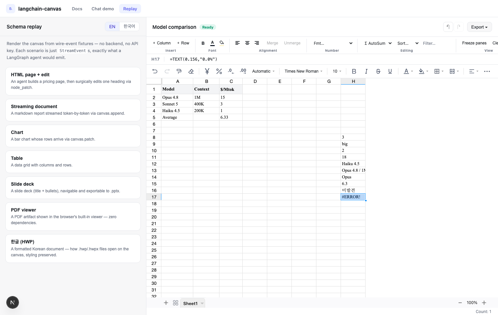
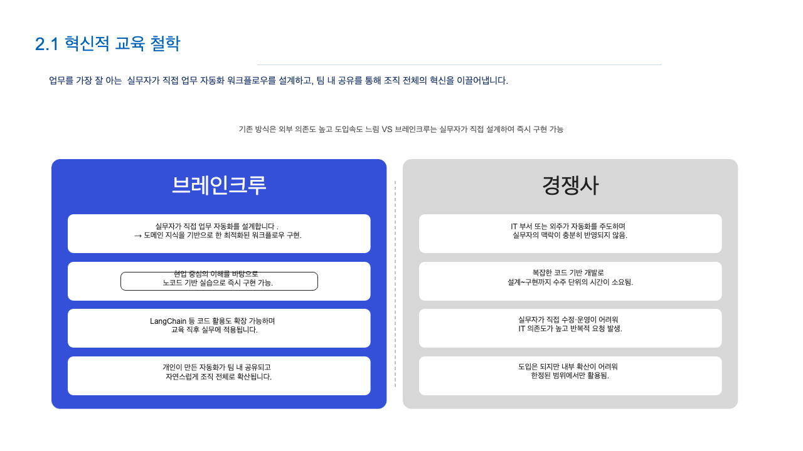
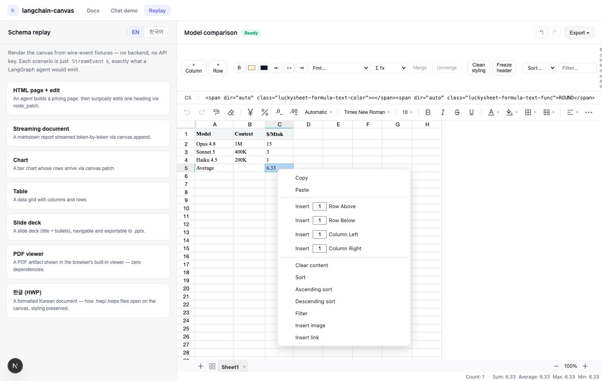
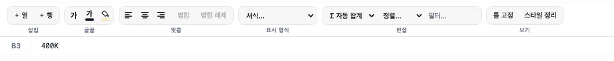

<div align="center">

# langchain-canvas

**A live, editable canvas for LangChain agents — Claude-Artifacts-style documents, decks, spreadsheets, charts and web pages, streamed over one wire protocol.**

Your agent writes ordinary tools; your users get a canvas — a panel beside the
chat where artifacts render live, stream as they're written, version themselves,
and can be edited by clicking any element.

[](https://www.npmjs.com/package/@braincrew-lab/langchain-canvas)
[](LICENSE)

[npm](https://www.npmjs.com/package/@braincrew-lab/langchain-canvas) · [Docs](docs/01-architecture.md) · [Changelog](CHANGELOG.md) · [Demo — schema replay, no backend](#see-it-with-zero-backend-schema-replay)

**English** · 📖 [한국어](README.ko.md)

</div>

```
┌───────────────────────────┬─────────────────────────────────────┐
│  chat                     │  canvas                              │
│                           │  ┌────────────────────────────────┐  │
│  › build me a pricing page│  │  Starter   Pro   Enterprise    │  │
│                           │  │  $0        $20    Contact us    │  │
│  ✓ Built a page — click   │  │  [ hover → highlight,          │  │
│    any element to edit.   │  │    click → edit this element ] │  │
│                           │  └────────────────────────────────┘  │
└───────────────────────────┴─────────────────────────────────────┘
```

## Screenshots

<table>
  <tr>
    <td width="50%">
      
      <sub>A real spreadsheet: formula bar, Σ AutoSum, number formats, freeze panes — formulas evaluate live.</sub>
    </td>
    <td width="50%">
      
      <sub>A <code>.pptx</code> dropped on the canvas — theme colors, master styles, and layout survive the trip.</sub>
    </td>
  </tr>
  <tr>
    <td width="50%">
      
      <sub>The themed grid: in-sheet context menu (sort · filter · insert), clean-styling and freeze-header controls.</sub>
    </td>
    <td width="50%">
      
      <sub>The same ribbon in Korean — <code>&lt;Canvas locale="ko"&gt;</code> localizes the whole chrome (Σ 자동 합계 · 틀 고정).</sub>
    </td>
  </tr>
</table>

---

## Table of contents

- [See it with zero backend (schema replay)](#see-it-with-zero-backend-schema-replay)
- [Add a canvas to your own app](#add-a-canvas-to-your-own-app)
- [The three ideas](#the-three-ideas)
- [Features](#features)
- [What to emit per artifact type](#what-to-emit-per-artifact-type)
- [Add your own artifact type](#add-your-own-artifact-type)
- [Docs](#docs) · [Roadmap](#roadmap) · [License](#license)

---

## See it with zero backend (schema replay)

The canvas is defined entirely by a **wire schema** — a stream of `StreamEvent`s.
So you can render it from a fixture, with no backend, no LLM, and no API key.
This is the fastest way to see it and to build renderers:

```bash
pnpm install
pnpm dev:web                  # → open http://localhost:3000/replay
```

Pick a scenario (HTML page, streaming doc, chart, table, deck, PDF, 한글 HWP) and
watch it render exactly as a real agent would drive it. In code:

```tsx
import { Canvas, useCanvasReplay, scenarios } from "@braincrew-lab/langchain-canvas";

const { play } = useCanvasReplay();
play(scenarios[0].events);    // schema → screen, no network
```

> A LangChain/LangGraph backend emits these same events on LangGraph's `custom`
> stream channel; the frontend doesn't care whether they come from a fixture or a
> live agent. Develop against fixtures now, plug the real agent in when it's ready.

## Add a canvas to your own app

Two installs, two small pieces of code.

```bash
npm i @braincrew-lab/langchain-canvas
```

> The Python package isn't on PyPI yet — install it from this repo (see
> `packages/canvas-py` and `apps/server/pyproject.toml` for the wiring).

### Backend (Python) — emit artifacts from a tool

```python
from langchain.tools import tool, ToolRuntime
from langchain_canvas import Canvas, create_canvas_agent, sse_from_agent

@tool
def build_page(brief: str, runtime: ToolRuntime) -> str:
    """Design an HTML page and show it on the canvas."""
    canvas = Canvas.from_runtime(runtime)          # 1. grab the canvas
    page = canvas.open_html(title=brief)           # 2. open an artifact
    page.set_html("<h1>Hello</h1>")                # 3. fill it (or .append(...) to stream)
    page.complete()
    return "Page is on the canvas."

agent = create_canvas_agent(model="anthropic:claude-sonnet-4-5", tools=[build_page])
```

Serve it over SSE with FastAPI:

```python
from fastapi import FastAPI
from fastapi.responses import StreamingResponse
from pydantic import BaseModel

app = FastAPI()

class Body(BaseModel):
    thread_id: str
    message: str

@app.post("/api/chat")
async def chat(body: Body):
    inputs = {"messages": [{"role": "user", "content": body.message}]}
    config = {"configurable": {"thread_id": body.thread_id}}
    return StreamingResponse(sse_from_agent(agent, inputs, config=config),
                             media_type="text/event-stream")
```

### Frontend (React) — render it

```tsx
"use client";
import { Canvas, useCanvasStream } from "@braincrew-lab/langchain-canvas";
import "@braincrew-lab/langchain-canvas/styles.css";

export default function Page() {
  const { sendMessage, messages, canvas, isStreaming, editSelection } =
    useCanvasStream({ endpoint: "/api/chat" });

  return (
    <div style={{ display: "grid", gridTemplateColumns: "400px 1fr", height: "100vh" }}>
      <YourChatUI messages={messages} onSend={sendMessage} busy={isStreaming} />
      <Canvas onEditElement={editSelection} />   {/* click-to-edit wired in */}
    </div>
  );
}
```

That's it. `useCanvasStream` sends the message, parses the stream, and keeps both
the transcript (`messages`) and the canvas in sync; `<Canvas />` draws whatever
the agent emits. You bring the chat bubbles; the canvas is done.

A copy-pasteable version of both sides is in
[`docs/03-getting-started.md`](docs/03-getting-started.md).

---

## The three ideas

Every modern canvas (ChatGPT `canmore`, Claude `antArtifact`, Vercel AI SDK data
parts) converges on the same design. `langchain-canvas` is that design, minimal:

1. **Artifacts are emitted, never parsed.** The agent opens a canvas by calling a
   tool — no magic tokens in the prose.
2. **A `type` string selects a renderer.** The backend ships data (`{ type, data }`),
   never JSX. The frontend owns the `type → component` registry.
3. **A stable `id` reconciles everything.** Same `id` → mutate in place; new `id`
   → new artifact. That one rule powers streaming, patching, and versioning.

Under the hood it rides LangChain 1.x's native custom-stream channel
(`ToolRuntime.stream_writer` → `stream_mode="custom"`) — no framework fork.

## Features

### Artifacts & streaming

- 🌐 **HTML is the base** — the agent emits a self-contained page, rendered in a
  CSP-sandboxed iframe. Documents, decks, grids, and charts are structured
  conveniences on top.
- 📝 **Streaming documents** — markdown rendered live, token-by-token.
- ⚡ **O(1) element patches** — `canvas.node_patch` swaps one element by its
  `data-cid` instead of resending the page.
- 🗂️ **Tabs + versioning** — switch between artifacts; page through every version
  (old versions are read-only previews, so history can't be silently overwritten).
- 🧵 **Typed on both ends** — Pydantic and TypeScript mirror one wire protocol.

### Rich editors, per type

- 📊 **Excel-grade tables** — a grouped ribbon (Insert / Font / Alignment /
  Number / Editing / View), a formula bar, **Σ AutoSum**, live formulas
  (`VLOOKUP`, `SUMIF`, `COUNTIF`, `INDEX`/`MATCH` and the rest of the Excel set,
  evaluated by the optional `fast-formula-parser`), number/currency/percent/date
  formats, cell merge, and freeze panes.
- 🖼️ **Figma-grade slides** — multi-select (Shift+click, marquee), group/ungroup
  (⌘G), snap guides on drag *and* resize, rotation, z-order (⌘] / ⌘[), arrow-key
  nudge, aspect-lock resize, **8 themes** (Editorial · Gallery · Boardroom ·
  Sage · Graphite · Observatory · Ultramarine · Bordeaux), speaker notes, and a
  present mode with progress.
- 🖱️ **Click-to-edit web pages** — hover highlights, click selects, then either
  type an instruction (the agent surgically patches just that element) or use the
  **style panel** and **double-click to edit text inline**.
- 📈 **Charts** — line/bar/area/pie on ECharts, switchable in one click, with
  inline data editing and per-series recoloring.
- 📄 **PDF viewer** — `type: "pdf"` renders `{ src }` in the browser's built-in
  viewer, with data:/blob:/https sources pinned to `application/pdf`.

### File round-trip

- 📥 **Import** — drop `.csv`, `.md`, `.html`, `.json`, `.xlsx` (fonts, fills,
  merges, formats, embedded images), `.docx`, `.pptx` (theme colors, master
  inheritance), `.pdf`, and Korean **`.hwpx` / `.hwp`** (binary HWP 5.x parsed
  from scratch into formatted HTML) straight onto the canvas.
- 📦 **Export** — any artifact → self-contained **`.html`** or **PDF**, plus
  `.md` / `.csv` / `.xlsx` / `.docx` / `.pptx` / **`.hwpx`** per type.
- 🪶 **Zero-dependency importers** — the Office/HWP paths use platform
  primitives (`DecompressionStream`, `DOMParser`); only `.xlsx` dynamically
  imports `exceljs`, and a missing optional package degrades to a clear message.

### Integration

- ✏️ **Write-back** — pass `onUserEdit` and every in-canvas edit (including
  undo/redo) hands your host the reconciled artifact, so the agent's next turn
  sees what the user actually changed.
- 🌏 **i18n** — `<Canvas locale="ko" />` localizes the entire chrome (English /
  Korean).
- 🧩 **Pluggable renderers** & 🔌 **headless core** — register `type → component`,
  or use the reconciler/SSE client with your own UI.

## What to emit per artifact type

The `type` string selects the renderer, so **send the shape that matches the type
you want** — a table wrapped in `html` renders as a web page, not a grid. One
`canvas.create` line per artifact:

| type       | renders as        | `data` you must ship                                  |
| ---------- | ----------------- | ----------------------------------------------------- |
| `html`     | web page (iframe) | `{ html }`                                             |
| `document` | Word-style doc    | `{ format: "markdown", content }`                     |
| `slides`   | PowerPoint deck   | `{ slides: [{ layout, title, bullets, … }] }`         |
| `table`    | Excel-style grid  | `{ columns: [{ key, label }], rows: [{ … }] }`        |
| `chart`    | line/bar/area/pie | `{ chart, xKey, rows, series: [{ key, label }] }`     |
| `pdf`      | native PDF viewer | `{ src, filename? }` — a `data:application/pdf;…` or https URL |

```json
{ "type": "canvas.create", "artifact": {
  "id": "deck-1", "type": "slides", "title": "Pitch", "version": 1, "status": "complete",
  "data": { "slides": [
    { "layout": "title",   "title": "AI for business", "subtitle": "2026 outlook" },
    { "layout": "content", "title": "Why now", "bullets": ["Cheaper models", "Real ROI"] }
  ] }
} }
```

Only have **pre-rendered HTML**? Keep `type: "html"` and label the content with
`meta` + in-HTML markers — a slide is `meta: { kind: "slide", ratio: "16:9" }` over
a `1280×720 .slide-container`; a table wraps its `<table>` in
`<div data-dataframe-table="true">`. Full copy-paste examples and gotchas (slide
scaling, web-page scrolling, why a document must use `type: "document"`) are in the
[wire protocol → *What to emit per type*](docs/02-protocol.md#what-to-emit-per-type--copy-paste-examples).

## Add your own artifact type

Three steps, zero transport changes:

1. Add its data shape to both `protocol` modules (Python + TS).
2. Emit it from a tool (`canvas.open_*`, or a raw `canvas.create`).
3. Register a renderer: `<Canvas registry={{ ...builtinRenderers, kpi: KpiRenderer }} />`.

## Docs

- [Architecture](docs/01-architecture.md) — the boundaries and why they exist.
- [Wire protocol](docs/02-protocol.md) — every event and its reconciliation effect.
- [Getting started](docs/03-getting-started.md) — copy-paste, front to back.
- [Changelog](CHANGELOG.md) — what shipped, release by release.
- [Contributing](CONTRIBUTING.md).

## Roadmap

- One-click **publish → shareable URL** and `<iframe>` embed
- Multi-agent **parallel section fill** (subagents patch different regions live)
- Self-critique visual loop (agent screenshots and refines its own page)
- `code` artifacts (Monaco + diff) · HTML → React component export
- Durable, reload-surviving version history via a LangGraph checkpointer

## License

[MIT](LICENSE)
