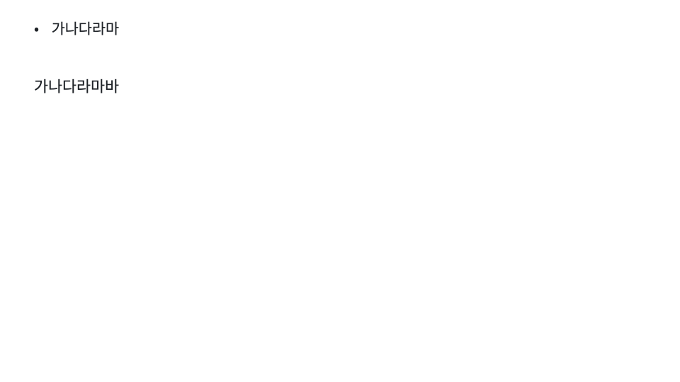

# Office render parity verification

## Scope and limits

The slide estimator, mounted editor/thumbnail, print sheet and PPTX writer now share the 96 dpi page, default leading and bullet hanging column. Browser-grown boxes add a font-derived ink guard; PPTX geometry keeps the estimator height. Rectangle corners, line connectors and scaled stroke/spacing geometry match the declared shapes. Both DOCX writers declare Letter with 1 inch margins and size tables from that text column. The browser Word exporter preserves the shared markdown block contract.

PNG/JPEG/GIF data images are embedded without requiring `createImageBitmap`. Original compressed bytes are preserved; the TypeScript parser checks bounded container/header structure and dimensions, not compressed-pixel integrity. Invalid/unsupported image bytes raise a descriptive export error rather than silently dropping an image. Malformed data URIs with alt text retain the fallback text; those without alt text fail explicitly. Remote-image behavior is unchanged. TypeScript retains natural pixel dimensions capped at 6 inches; Python retains its existing explicit 6-inch width. Image-size equality between these policies is not claimed.

Native Microsoft Word and PowerPoint rendering is **UNVERIFIED**. LibreOffice may choose its own `normAutofit` scale and substitute DOCX fonts; see [the protocol contract](../02-protocol.md). Existing saved files are unchanged until re-exported. New export geometry/default margins change deliberately. No dependency versions, package versions, consumer Builder version, deployment or release are changed here.

## Independently executed checks

On 2026-09-09, using Node 24.15.0, Chromium 149.0.7827.55 and LibreOffice 25.2.3.2 (Docker arm64):

| Check | Result |
|---|---|
| Mapped TypeScript tests, eight files below | 100 passed, zero skipped |
| Mapped Python tests, seven files below | 296 passed, zero skipped |
| Chromium print / mounted / snug / image gates | 9 / 9 / 4 / 3 passed, zero skipped |
| LibreOffice R1–R6 and D1–D4, including parametrized R4 | 11 passed, zero skipped |
| `tsc --noEmit` | exit 0 |
| Ruff, Python source and changed Python tests | all checks passed |
| mypy, Python source | no issues in 33 source files |
| Production ESM and declaration build | success |
| `git diff --check` (tracked changes before staging) | exit 0 |
| Final staged whitespace check | only the intentional Markdown two-space hard break at `parity-document.md:6`; all other paths clean |

The jsdom unit run emits its existing `HTMLCanvasElement.getContext` not-implemented diagnostic; the real-browser gates pass. This package has no configured ESLint/Biome gate; no new linter was installed.

Print and mounted parity use actual text-node `Range.getClientRects()` line counts, not allocated height divided by leading. Equal-height negative controls produce different actual wrap counts (3 versus 6), proving the gate rejects false parity. Ink containment, zero hidden/visible pixel difference, page containment and neighbor clearance assertions remain strict.

The final browser-generated DOCX was run through D4 after the Chromium image cases, with no intervening unit overwrite. Source and D4-consumed bytes were independently compared and share SHA-256 `80abf210707eadd472f7edb8f0fb59a51abc3cdbec186427c2679ef067ab7937`. This identifies this run, not deterministic ZIP bytes across runs. ZIP tests check original media bytes, relationship targets, drawing references and extents in native, absent and rejecting bitmap environments. The preceding detailed verification manifest was also checked: all 67 entries matched their hashes.

## Reproduction

Run from the repository root with the workspace dependencies installed. These are diff-mapped commands, not full repository suites:

```sh
pnpm --dir packages/canvas-react exec vitest run src/export/exporters.test.ts src/client/slideText.test.ts src/components/renderers/FreeSlide.test.ts src/export/pdf.test.ts src/export/markdownBlocks.test.ts src/export/wordPageContract.test.ts src/io/docxAddress.test.ts src/export/docxImage.test.ts
uv run --offline --project packages/canvas-py --with pytest-timeout pytest packages/canvas-py/tests/test_exporters.py packages/canvas-py/tests/test_office_render_support.py packages/canvas-py/tests/test_slide_text.py packages/canvas-py/tests/test_office_parity.py packages/canvas-py/tests/test_layout_lint.py packages/canvas-py/tests/test_pptx_import.py packages/canvas-py/tests/test_document_ops.py -q --timeout=10
pnpm --dir packages/canvas-react exec tsc --noEmit
packages/canvas-py/.venv/bin/ruff check packages/canvas-py/src packages/canvas-py/tests/test_exporters.py packages/canvas-py/tests/test_office_render_gate.py packages/canvas-py/tests/office_render_support.py packages/canvas-py/tests/test_office_parity.py packages/canvas-py/tests/test_office_render_support.py packages/canvas-py/tests/test_layout_lint.py packages/canvas-py/tests/test_pptx_import.py packages/canvas-py/tests/test_slide_text.py
packages/canvas-py/.venv/bin/mypy packages/canvas-py/src
pnpm --dir packages/canvas-react run build
```

The browser/render suites are opt-in and are not unconditional host-sensitive CI gates. Enabling them makes missing prerequisites fail, never skip. They require Playwright Chromium, the existing recorded Docker image `sha256:aa6d1c9ddcbead7da95dce92f3bee979b1d9c4731abfe7b149b8ef19cd96951b`, and the PDFium bindings used by the render support. That local image is not distributed by this repository; a clean checkout without it cannot run the exact render gate. No global font installation is necessary.

Set `CANVAS_PARITY_EVIDENCE_DIR` to an absolute writable scratch directory. Extract `/usr/share/fonts/opentype/noto/NotoSansCJK-Regular.ttc` from the recorded image into its `fonts/` subdirectory. R1 writes `env/render-gate-preflight.json`; the font server compares its in-image hash with the served bytes. Expected font SHA-256: `b76b0433203017ca80401b2ee0dd69350349871c4b19d504c34dbdd80541690a`. Set `PLAYWRIGHT_BROWSERS_PATH` if Chromium is not in the default `node_modules/.playwright-browsers` directory.

Run the following in order, preserving the same evidence directory. The final render follows the real browser export so D4 consumes browser-produced bytes:

```sh
CANVAS_OFFICE_RENDER_GATE=1 uv run --offline --project packages/canvas-py --with pytest-timeout pytest packages/canvas-py/tests/test_office_render_gate.py::test_preflight_the_render_environment_is_the_recorded_one -q --timeout=60
pnpm --dir packages/canvas-react exec vitest run src/export/exporters.test.ts
CANVAS_BROWSER_GATE=1 pnpm --dir packages/canvas-react exec vitest run src/export/printGeometry.browser.test.ts src/export/mountedParity.browser.test.ts src/export/snugBullet.browser.test.ts src/export/docxImage.browser.test.ts
CANVAS_OFFICE_RENDER_GATE=1 CANVAS_PARITY_RENDER_STAGE=verification uv run --offline --project packages/canvas-py --with pytest-timeout pytest packages/canvas-py/tests/test_office_render_gate.py -v -rs --timeout=60
```

The render timeout permits Docker/LibreOffice startup. Detailed local logs, Office files, PDFs and measurement JSON are intentionally not committed. Fonts and local orchestration configuration are excluded as well.

## Synthetic screenshot evidence

Only the synthetic snug fixture is published; these images contain no customer text. The pre-fix screenshot is retained regression evidence, not a claim of a freshly rerun baseline. The post-fix screenshot comes from the independent final browser rerun. The last bullet glyph is restored without clipping the plain control.

| Before correction | After correction |
|---|---|
|  |  |

## Review disposition

No blocking finding remained after the focused independent source review and fresh gates. Bounds checks in `docxImage.ts` prevent out-of-range chunk/segment reads, and `docxImage` either returns a picture paragraph or throws. The markdown tuple schema and original media bytes are preserved. Native Office, other platform font substitutions, and exotic image layouts remain explicit limits rather than passing claims.

The protocol documentation is updated. No existing project wiki contract changes; a separate wiki update is not applicable. The large diff is principally cross-language regression tests, shared synthetic fixtures and opt-in renderer measurement support, rather than unrelated product work. Existing large exporter modules were deliberately not refactored during this fix.
